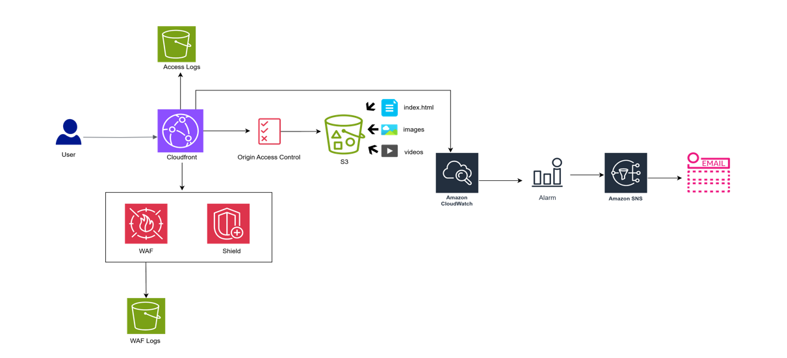

 #Smart Learning Zone – AWS Static Website Deployment

## 📌 Overview
**Smart Learning Zone** is an e-learning platform providing tutorials, downloadable resources, and course content on AWS technologies.

This project demonstrates how to deploy a **secure, scalable static website** on AWS using:
- **Amazon S3** – for storing and hosting static files
- **Amazon CloudFront** – for global content distribution
- **AWS WAF** – to protect against common web exploits
- **AWS Shield** – for DDoS protection
- **AWS CloudWatch** – for logging, monitoring, and alerts

> ⚠️ **Note:** The AWS services for this project have been shut down (free tier ended). This repository preserves the **architecture, steps, and site files** as a reference.

---

## 🏗 Architecture
 <!-- optional if you have an image -->

**AWS Services Used:**
- **Amazon S3**: Secure object storage for static website files  
- **CloudFront**: Global CDN with low latency delivery  
- **AWS WAF & Shield**: Web application security & DDoS protection  
- **CloudWatch**: Real-time monitoring and alerts  

---

## 🚀 Quick Deployment Steps
1. **Create S3 Bucket** – Enable versioning, block public access, turn on static website hosting.
2. **Upload Files** – Use AWS S3 Console UI to upload `index.html`, assets, and resources.
3. **Set up CloudFront** – Create a distribution with Origin Access Control (OAC) linked to the S3 bucket.
4. **Restrict Bucket Access** – Update bucket policy to allow only the CloudFront OAC principal.
5. **Add WAF Protection** – Attach AWS Managed Rules and custom rules for security.
6. **Enable Logging & Monitoring** – Store CloudFront and WAF logs in S3, set CloudWatch alarms.
7. **Test & Verify** – Check site availability via CloudFront URL, validate WAF rules, review logs.

---

## 📖 Full Deployment Guide
For the **complete step-by-step process with screenshots**, see the PDF:  
[📄 Open Deployment Guide](Deployment_docs/Deployment_steps.pdf)
